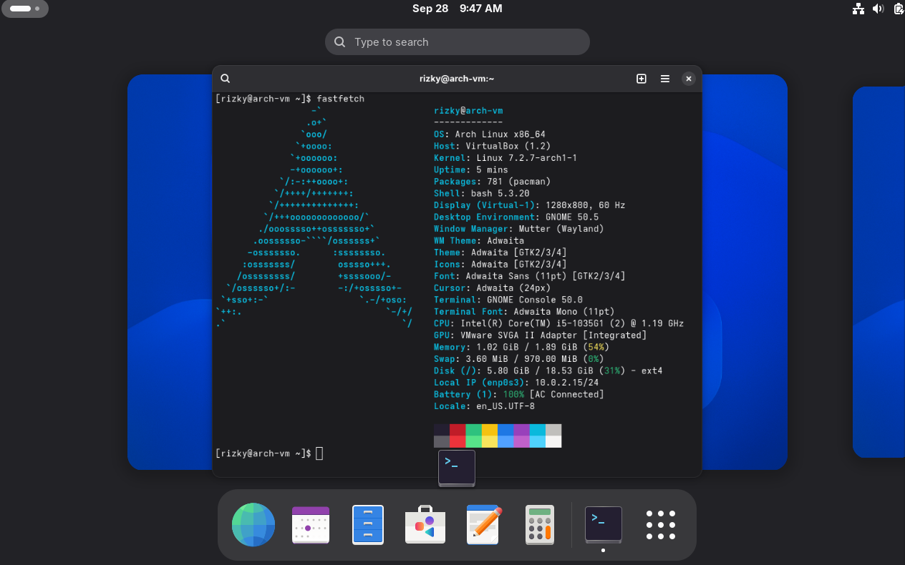

# ky-arch-linux-setup
# 🚀 My first successful Arch Linux &amp; Ubuntu setup👋

> "I use Arch, btw." 😎

This repository documents my successful installation of **Ubuntu** and **Arch Linux** using Oracle VM VirtualBox for my college assignment.

## 🛠️ System Overview (Arch Linux)

- **OS:** Arch Linux x86_64
- **Host / Environment:** VirtualBox
- **Kernel:** Linux Standard
- **Shell:** Bash
- **DE/WM:** KDE / GNOME
- **Terminal:** Console / Fastfetch

## 📌 Milestones Achieved
- [x] Ubuntu installation completed offline
- [x] Arch Linux base system & desktop environment installed
- [x] System verified with `fastfetch`

---
*Maintained by Muhammad Rizky Ramadhan*
